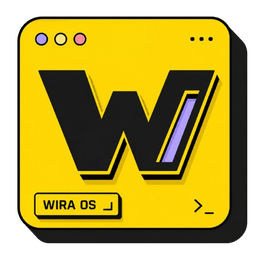

<p align="center">
  
</p>

<h1 align="center">WOS — Wealth Operating System</h1>

<p align="center">
  <strong>Open-source personal finance & wealth management platform.</strong><br />
  Multi-platform. Offline-first. Beautifully engineered.
</p>

<p align="center">
  <a href="https://github.com/sepatusendal/wos/actions"></a>
  <a href="https://github.com/sepatusendal/wos/releases"></a>
  <a href="./LICENSE"></a>
  <a href="#"></a>
  <a href="#"></a>
</p>

---

## ✨ Features

| Module | Description | Web | Desktop |
|--------|-------------|-----|---------|
| 📊 **Dashboard** | Financial overview with charts & KPIs | ✅ | ✅ |
| 💰 **Finance** | Income/expense tracking, categories, accounts | ✅ | ✅ |
| 📈 **Net Worth** | Asset & liability tracker with history | ✅ | ✅ |
| 📦 **Subscriptions** | Recurring billing manager | ✅ | ✅ |
| ✅ **Habits** | Daily habit tracker with streaks | ✅ | ✅ |
| 📝 **Todos** | Task manager with priorities & tags | ✅ | ✅ |
| 🏦 **Wealth** | Investment portfolio & asset allocation | ✅ | ✅ |
| 🔐 **Vault** | Encrypted password & credential storage | ✅ | ✅ |
| 📅 **Calendar** | Financial calendar view | ✅ | ✅ |
| 🌙 **Dark Mode** | Light / Dark / System-auto themes | ✅ | ✅ |
| 📤 **Export** | CSV, JSON, PDF transaction reports | ✅ | ✅ |
| 💱 **Multi-Currency** | 16 currencies with live exchange rates | ✅ | ✅ |

## 🏗 Architecture

```
wos/
├── apps/
│   ├── web/          Next.js 16 · React 19 · Tailwind CSS 4
│   └── desktop/      Tauri v2 · Vite 8 · Rust backend
├── packages/
│   ├── ui/           Neubrutalism design system + feature modules
│   ├── db/           Drizzle ORM · libsql/Turso · Tauri SQLite
│   └── shared/       Validation · Crypto · Currency · Formatting
├── .github/          CI/CD · Issue & PR templates
└── turbo.json        Turborepo orchestration
```

## 🚀 Quick Start

```bash
# Clone
git clone https://github.com/sepatusendal/wos.git
cd wos

# Install
npm install

# Web
npm run dev          # → http://localhost:3000

# Desktop (requires Rust)
npm run desktop      # → Tauri dev window
```

## 🧪 Tech Stack

| Layer | Technology |
|-------|-----------|
| **Frontend** | React 19, Next.js 16, Tailwind CSS 4 |
| **Desktop** | Tauri v2, Rust |
| **State** | Zustand 5 |
| **Database** | Drizzle ORM, libsql/Turso, SQLite |
| **Language** | TypeScript 5.9 |
| **Build** | Turborepo, Vite 8 |
| **CI/CD** | GitHub Actions |

## 🤝 Contributing

We welcome contributions! See our open issues — especially those tagged `good first issue`.

```bash
git clone https://github.com/sepatusendal/wos.git
cd wos
npm install
git checkout -b feat/my-feature
# ... make changes ...
git push origin feat/my-feature
# Open a PR!
```

## 📄 License

MIT © 2026 [sepatusendal](https://github.com/sepatusendal) & [contributors](https://github.com/sepatusendal/wos/graphs/contributors).
